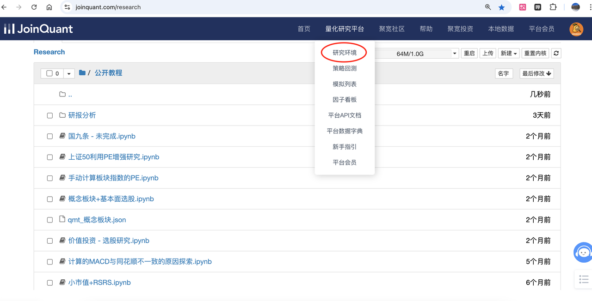
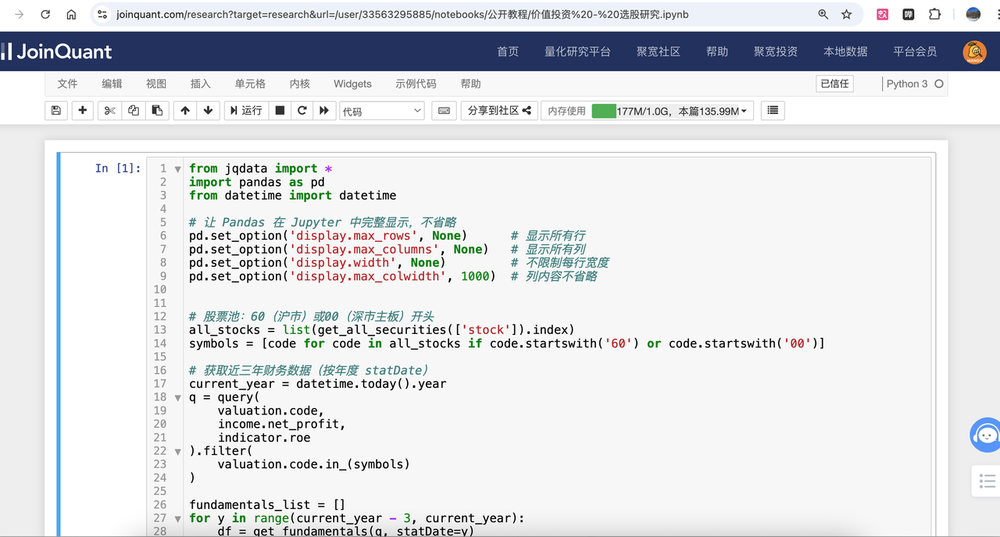
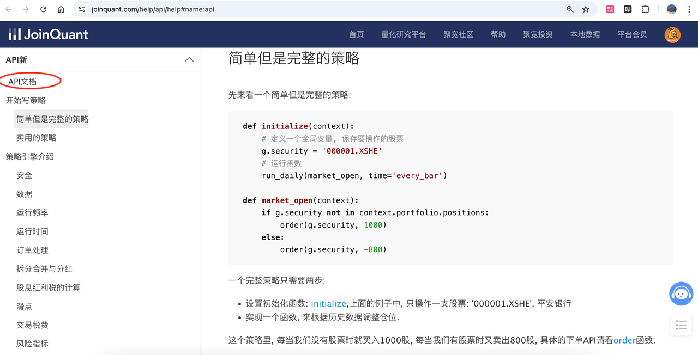
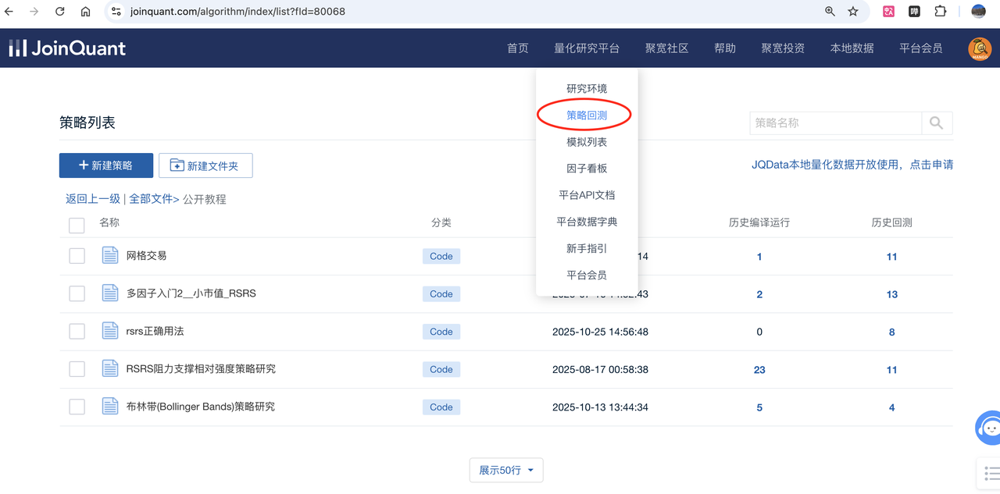
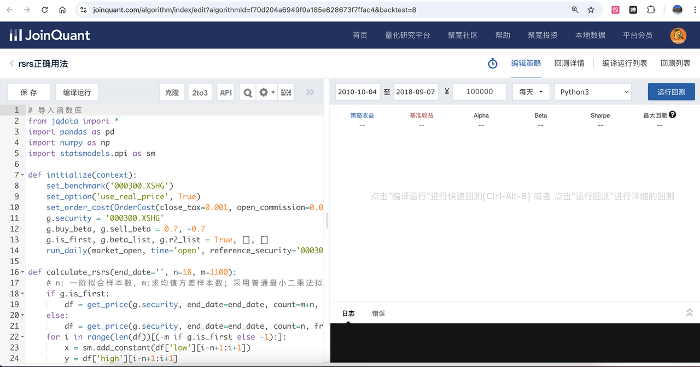
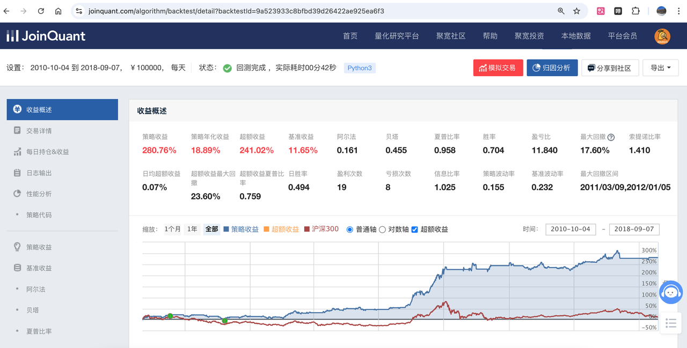
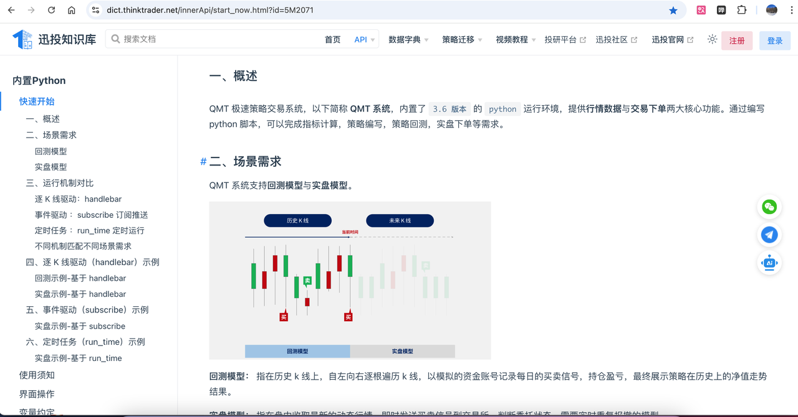
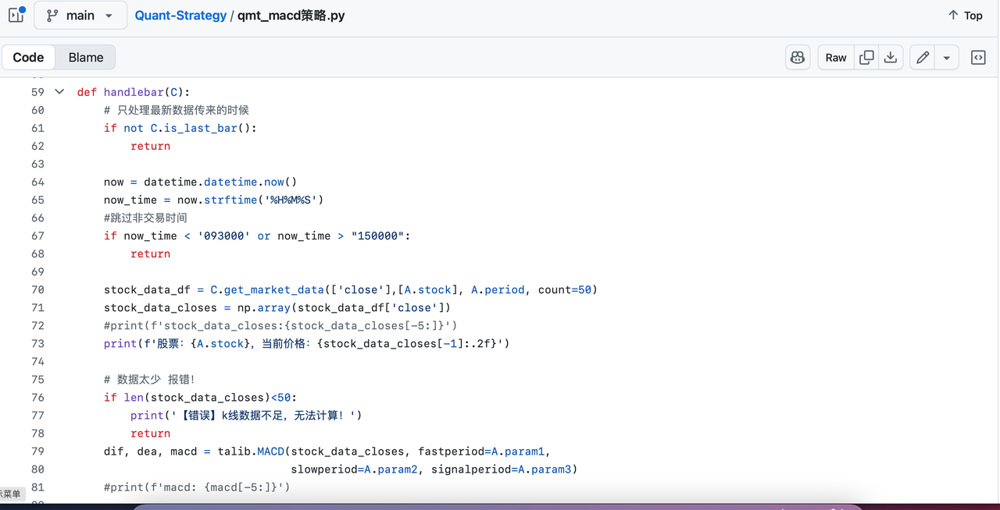
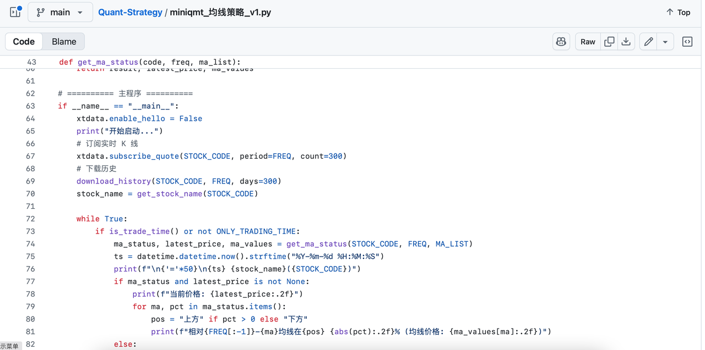

目录
- [前言](#前言)
- [主要内容](#主要内容)
  - [1.聚宽joinquant的0基础使用 - 研究为主](#1聚宽joinquant的0基础使用---研究为主)
    - [a.聚宽研究环境](#a聚宽研究环境)
    - [b.策略回测部分](#b策略回测部分)
  - [2.QMT的0基础使用 - 实盘为主](#2qmt的0基础使用---实盘为主)
    - [a.大QMT](#a大qmt)
    - [b.小QMT（mini QMT）](#b小qmtmini-qmt)
  - [3.总结](#3总结)
  - [4.进一步发展](#4进一步发展)
- [公益部分](#公益部分)

## 前言
最近半年，我在各大平台上进行<b>免费、开源</b>分享了一些量化代码、教程。昵称叫做“芒果量化”（[小红书](https://www.xiaohongshu.com/user/profile/5cd95d290000000005038083)、[GitHub](https://github.com/JizhiXiang/Quant-Strategy)、[CSDN博客](https://blog.csdn.net/2401_82851462)），出发点是为了致敬投资大师“查理芒格”。免费分享了资料后，收到了一些朋友的<b>好评</b>，<mark>但也有些朋友反馈对新手不是很友好，特别是对零基础从没接触过量化交易的来说，无从入手，想让我引导从零入门量化交易。</mark>
正好机缘巧合之下，这段时间准备在家呆着不去上班了。于是我想借着这个机会，花<b>一个月时间</b>（4周、除去周末），<b>每天晚上直播授课半小时</b>，带着想入门的朋友一起学习一下。上课讲的东西不懂的可以私下答疑，要是公共问题多就进行答疑课程。如果人数合适，打算11月中旬或者12月上旬开课。
【注：支持试听一节课，提前购买可以解答python问题】
购买链接：
>【闲鱼】https://m.tb.cn/h.Sm9v2HP?tk=EmwIffiJRkE
HU108 「我在闲鱼发布了【《零基础量化交易入门》直播授课-芒果量化】」
点击链接直接打开

## 主要内容
### 1.聚宽joinquant的0基础使用 - 研究为主
之所以选择聚宽，主要是因为免费+方便，无需本地下载大量的A股历史数据就能进行回测；且社区中有大量别人现成的策略，能够支持一键克隆。
#### a.聚宽研究环境

这里主要学习如何使用jupyter记事本的形式进行研究某个策略的细节，主要注重函数的使用，调试输入输出是否符合预期。满足预期后，我们再将核心策略放入回测部分（下一部分内容）进行历史数据验证。

这期间也会穿插着对API文档里的关键函数进行学习，学完后不仅会了一些常用的函数，更是自己会阅读官方文档，能使用一些从没见过的函数了。

#### b.策略回测部分

这块包括怎么从头新建策略，怎么进行回测历史数据。并且介绍一下回测框架、核心函数及代码。学完这部分，可以根据别人的策略或者自己写的进行回测，验证策略的好坏，是否值得上实盘。

### 2.QMT的0基础使用 - 实盘为主
选择QMT的原因是国内A股支持量化交易，提供免费API接口，开通门槛相对来说较低（国金10w入金）；同时相对其他的软件（如ptrade）稍微稳定一些；并且支持本地运行策略、独立交易模式。
（这里需要提前开通账号，并且拥有模拟账户。不过QMT目前仅支持windows系统）
#### a.大QMT
对于初学者来说，运行起来上手稍微简单一点。
我将带着一步步操作，并且介绍如何使用内置的函数，调用行情数据，执行策略处理，最终进行下单买入或卖出。

#### b.小QMT（mini QMT）
小QMT能够直接在我们自己的IDE（比如pycharm、vscode等）上进行开发；仅需要开启交易模块，写代码的灵活性也大大增强，稳定性也比大QMT要好，但也对我们代码能力有进一步要求。

学习了这部分后，我们就能够将策略进行实盘（也可以模拟）交易，从而达到自动量化交易机器人的目的。
### 3.总结
本次直播授课主要是针对零基础但想学习量化的朋友，认真学习一个月后，能够编写简单的策略，并且会使用聚宽平台对进行回测查看效果，然后使用该策略用QMT进行实盘交易。到此，已经完成了一个量化交易的闭环。
（注：此次授课并不是研究某个具体的策略，而是学习整体量化交易的流程。）
### 4.进一步发展
等本次学习结束后，后续可以朝着策略的研究进行发展。比如因子质检、多因子策略，甚至使用机器学习、AI人工智能进行量化交易。
也可以在别人开源的策略上进行改进，回测看效果，优化模型。
或者切入其他领域，比如数字货币、期货等。
同时使用比较优秀的开源框架，如qlib、backtrader、freqtrade等。
那时候应该就能看懂我在CSDN、GitHub上写的文章、代码了。

相信你，用不了多久，就可以赚到量化交易的第一桶金了！

## 公益部分
因为量化交易使用的是python语言，在进入这门课程前，最好需要一定的python基础。
但是网上的一些python资料大部分是又多又长，令人生畏。所以在开课量化交易前，我这边准备有空的话，免费讲解一下必要的python知识，当然也是以零基础的视角来讲的。到时候会提前一天进行预告，感兴趣的关注下。
（但由于个人精力有限，如果私下解答问题、远程调试，可能会优先购买了《零基础量化交易入门》的学员朋友，见谅～）
